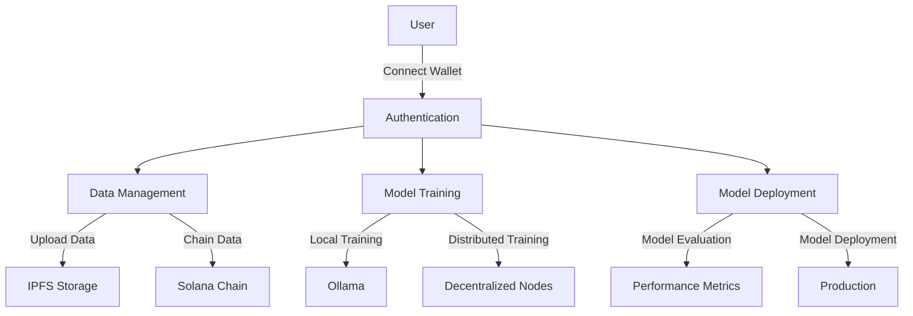

# Zephyr - Decentralized AI Training Platform for DeFi 🚀

<div align="center">


[](https://opensource.org/licenses/MIT)
[](https://www.python.org/downloads/)
[](https://solana.com/)

</div>

## 🌟 Overview

Zephyr is an innovative decentralized AI model training platform focused on Web3 financial (DeFi) applications. Built on the Solana blockchain, it leverages high throughput and low latency for decentralized financial behavior-specific AI model training.



## ✨ Core Features

- 🔐 Wallet-based Decentralized Authentication
- 📊 Real-time On-chain Data Integration
- 🤖 Local and Distributed Model Training
- 🚀 Ollama Local Deployment Support
- 📈 Real-time Model Evaluation
- 🌐 Complete RESTful API Support

## 🛠️ Technical Architecture

```
Zephyr Platform
├── Frontend Layer
│   ├── User Interface (HTML/CSS/JS)
│   └── Web3 Wallet Integration
├── Backend Services
│   ├── Authentication Service
│   ├── Data Processing Service
│   ├── Model Training Service
│   └── API Gateway
└── Blockchain Layer
    ├── Solana Smart Contracts
    └── IPFS Storage
```

## 🚀 Quick Start

### Prerequisites

- Python 3.8+
- Node.js 14+
- Solana CLI
- Ollama
- IPFS (optional)

### Installation Steps

1. **Clone Repository**
   ```bash
   git clone https://github.com/ZephyrDeFAI/zephyr.git
   cd zephyr
   ```

2. **Install Backend Dependencies**
   ```bash
   python -m venv venv
   source venv/bin/activate  # Windows: venv\Scripts\activate
   pip install -r requirements.txt
   ```

3. **Configure Environment Variables**
   ```bash
   cp .env.example .env
   # Edit .env with your configuration
   ```

4. **Start Application**
   ```bash
   # Start backend server
   python app.py

   # Access frontend
   open frontend/index.html
   ```

## 📖 Documentation

### Project Structure
```
zephyr/
├── README.md           # Project documentation
├── LICENSE            # MIT license
├── CONTRIBUTING.md    # Contribution guidelines
├── requirements.txt   # Python dependencies
├── .gitignore        # Git ignore rules
├── app.py            # Main application entry
├── routes/           # Route handlers
├── services/         # Service modules
└── frontend/         # Frontend assets
```

### API Documentation

| Endpoint | Method | Description |
|----------|--------|-------------|
| `/auth/connect-wallet` | POST | Connect wallet and authenticate |
| `/data/upload` | POST | Upload training data |
| `/model/train` | POST | Start model training |
| `/model/deploy` | POST | Deploy trained model |
| `/model/evaluate` | POST | Evaluate model performance |

## 🤝 Contributing

1. Fork the project
2. Create your feature branch (`git checkout -b feature/AmazingFeature`)
3. Commit your changes (`git commit -m 'Add some AmazingFeature'`)
4. Push to the branch (`git push origin feature/AmazingFeature`)
5. Open a Pull Request

## 📄 License

This project is licensed under the MIT License - see the [LICENSE](LICENSE) file for details

## 🌟 Acknowledgments

- [Solana](https://solana.com/)
- [Ollama](https://ollama.ai/)
- [IPFS](https://ipfs.io/)

## 📞 Contact

- Project Homepage: [GitHub](https://github.com/ZephyrDeFAI/zephyr)
- Issue Tracker: [Issues](https://github.com/ZephyrDeFAI/zephyr/issues)


---

<div align="center">
Made with ❤️ by the Zephyr Team
</div>
